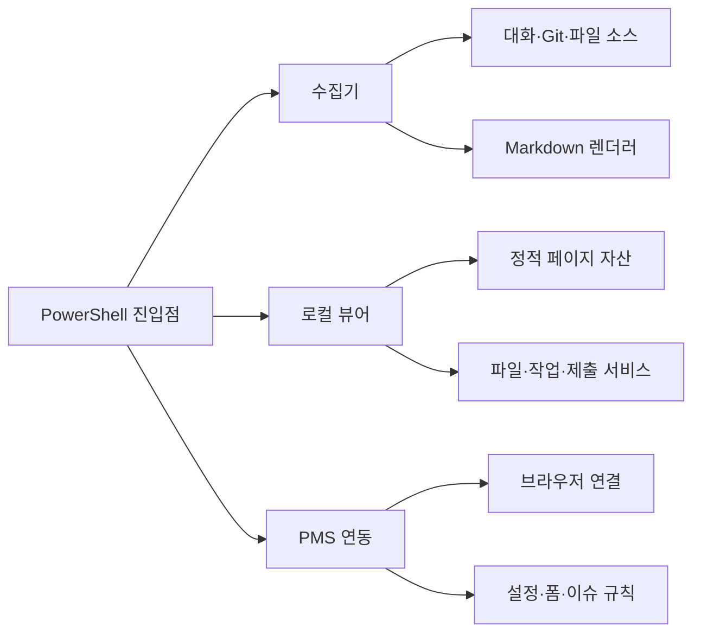

# work-report 아키텍처

이 문서는 work-report의 책임 경계와 실행 흐름을 설명한다. 구현 위치와 데이터 흐름을 기준으로 작성하며, 특정 변경 작업의 순서나 완료 조건은 다루지 않는다.

## 시스템 경계

work-report는 로컬에서 다음 기능을 제공한다.

1. **보고서 수집·작성**은 대화 기록, Git 이력, 사용자가 지정한 파일을 모아 Markdown 보고서를 만든다.
2. **로컬 뷰어**는 보고서와 실행 상태를 임시 HTTP 서버로 보여 주고 저장·실행 요청을 처리한다.
3. **PMS 연동**은 브라우저로 프로젝트 관리 시스템의 설정과 이슈를 조회하거나 폼을 채운다.

PowerShell 진입점은 기능을 연결하지만 수집 규칙, 페이지 동작, 브라우저 자동화의 세부 구현을 소유하지 않는다. 각 기능은 독립적으로 바뀔 수 있도록 Python 모듈과 정적 자산으로 나뉜다.



## SRP 원칙

모듈의 단위는 함수 수가 아니라 변경 이유로 정한다. 같은 이유로 함께 바뀌는 코드는 한 모듈에 두고, 다른 이유로 바뀌는 코드는 호출 관계로 연결한다.

- 수집 소스는 입력 형식만 해석하고, 보고서 문단과 Markdown 표현은 `render.py`가 담당한다.
- `viewer.py`는 HTTP 라우팅과 서비스 조합만 담당한다. 파일·작업·초기 설정·제출은 `viewer_*.py`가, 화면 표현은 `page/`의 HTML·JavaScript·CSS가 담당한다.
- `pms_browser.py`는 브라우저 연결과 공통 동작만 제공한다. 설정·폼·수집·이슈 규칙은 각각의 `pms_*.py`가 담당한다.
- PowerShell 환경 책임은 실행 파일 경로, 오류, 출력 형식, 알림, 뷰어 실행 모듈로 나뉜다.
- 일반 설정은 `config.json`에서 읽고, 인증 정보는 `pms/secrets.dat`(이 계정에서만 풀리는 암호문)에서 읽는다. 금고가 사실의 원본이며 `config.json`에 평문을 남기지 않는다. 보고서나 로그에도 비밀값을 기록하지 않는다.

## 모듈 지도

### 실행 진입점과 환경

| 위치 | 책임 |
| --- | --- |
| `skill/run-report.ps1` | 보고서 수집 실행과 결과 경로 전달 |
| `skill/collect.ps1` | 수집기 호출과 대화형 옵션 전달 |
| `skill/pms.ps1` | PMS 명령 선택과 종료 코드 전달 |
| `skill/open-viewer.ps1` | 뷰어 시작과 브라우저 열기 |
| `skill/_env.ps1` | 공통 환경 모듈 로드와 호환용 진입점 |
| `skill/_bins.ps1` | Python·Node·브라우저 실행 파일 탐색 |
| `skill/_errors.ps1` | 오류 기록과 사용자 오류 변환 |
| `skill/_formats.ps1` | 출력 형식과 문자열 변환 |
| `skill/_toast.ps1` | Windows 토스트 알림 |
| `skill/_viewer.ps1` | 뷰어 프로세스 시작·종료 |

### 보고서 수집

| 위치 | 책임 |
| --- | --- |
| `skill/scripts/collect.py` | 옵션 해석, 수집 순서 조정, 결과 조합 |
| `skill/scripts/model.py` | 수집 설정(`Ctx`)·세션(`Session`)과 기록 위치 탐색 |
| `skill/scripts/sources_claude.py` | Claude 대화 기록 탐색·변환 |
| `skill/scripts/sources_codex.py` | Codex 대화 기록 탐색·변환 |
| `skill/scripts/sources_git.py` | Git 로그·변경 파일·커밋 정보 수집 |
| `skill/scripts/sources_files.py` | 추가 파일 읽기와 메타데이터 수집 |
| `skill/scripts/custom_files.py` | 추가 파일 목록과 경로 규칙 |
| `skill/scripts/prompts.py` | `skill/prompts/ask.json` 질문과 선택지 로드 |
| `skill/scripts/render.py` | 수집 결과의 Markdown 렌더링 |

소스는 공통 데이터 구조를 반환하고 서로의 저장 형식에 의존하지 않는다. 새 소스는 `sources_*.py`와 `collect.py` 조합 지점에 추가하며, 보고서 문장 변경은 `render.py`에서 처리한다.

`Ctx`와 `Session`은 조정 모듈과 소스 모듈이 함께 쓰므로 진입점이 아니라 `model.py`가 소유한다. 진입점에 두면 소스가 진입점을 거꾸로 import해야 한다.

### 로컬 뷰어

| 위치 | 책임 |
| --- | --- |
| `skill/scripts/viewer.py` | HTTP 서버, 라우팅, JSON 직렬화, 서비스 조합 |
| `skill/scripts/viewer_files.py` | 보고서·설정·README·정적 파일 읽기 |
| `skill/scripts/viewer_jobs.py` | 보고서 작업 시작·조회·정리 |
| `skill/scripts/viewer_setup.py` | 설치 경로와 초기 설정 준비 |
| `skill/scripts/submission.py` | 작성 결과 저장과 제출 준비 |
| `skill/scripts/page/index.html` | 페이지 구조와 브라우저 진입점 |
| `skill/scripts/page/app.js` | API 호출과 화면 상태 조정 |
| `skill/scripts/page/app-ui.js` | 보고서·작업·설정 화면 렌더링 |
| `skill/scripts/page/app-setup.js` | 초기 설정 화면과 설치 흐름 |
| `skill/scripts/page/app.css` | 레이아웃과 시각 표현 |

뷰어는 `127.0.0.1`에 임시 서버를 열고 `GET /files`, `/jobs`, `/config`, `/bins`, `/setup`, `/readme`, `/report`, `/favicon.ico`, 정적 `/page/*`와 `POST /config`, `/run`, `/pms`, `/seen`, `/dismiss`를 제공한다. 페이지는 API 응답을 화면에 표시하며 파일 시스템이나 PMS 브라우저를 직접 다루지 않는다.

### PMS 연동

| 위치 | 책임 |
| --- | --- |
| `skill/scripts/pms.py` | CLI 인자 해석과 PMS 작업 조합 |
| `skill/scripts/pms_config.py` | URL·프로젝트·필드 설정 읽기 |
| `skill/scripts/pms_browser.py` | Playwright 연결과 공통 페이지 동작 |
| `skill/scripts/pms_form.py` | 설정 폼 수집과 정규화 |
| `skill/scripts/pms_harvest.py` | 보고서·프로젝트 데이터 수집 |
| `skill/scripts/pms_issues.py` | 이슈 조회·생성·상태 처리 |
| `skill/scripts/secrets.py` | `pms/secrets.dat` 금고 읽기·쓰기 (Windows DPAPI) |

`pms.py`는 인자를 읽어 알맞은 모듈을 부르는 조정 모듈이다. 실제 규칙은 세부 모듈에 있으므로 브라우저 연결 방식 변경이 설정·폼·이슈 규칙으로 번지지 않는다. 자기가 쓰지 않는 이름은 가져오지 않는다 — 통과만 시키는 이름은 호출자가 소유 모듈을 보지 못하게 가린다.

PMS 명령의 종료 코드는 `pms_config.py`가 소유하고 뷰어(`viewer_jobs.PMS_STATE`)와 `pms.ps1`이 그것을 쓴다. `0` 채웠다, `10` 채울 것이 없어 폼만 열었다, `2` 로그인 필요, `3` 설정이 비었다, `4` playwright 없음, `5` 크롬·포트 문제다. 숫자를 다른 파일에 다시 적지 않는다.

## 의존성 방향

의존성은 진입점에서 책임 모듈로 흐른다. 책임 모듈이 상위 진입점을 import하지 않도록 하여 순환 의존성과 실행 환경 의존성을 막는다.

```text
PowerShell 진입점
    ├─> collect.py ─> model / sources_* / custom_files / render
    ├─> viewer.py  ─> viewer_files / viewer_jobs / viewer_setup
    └─> pms.py     ─> pms_config / pms_browser / pms_form / pms_harvest / pms_issues

공통 하위 계층 ─> model / prompts / submission / secrets / _log
                 메시지·경로 상수 / 표준 라이브러리·외부 실행기
```

순환은 없다. 함수 안으로 숨긴 import도 두지 않는다 — 그것은 경계가 틀렸다는 신호이므로, 공유되는 것을 공통 계층으로 내린다.

**같은 사실을 두 곳에 적지 않는다.** 상수는 소유 모듈에서 import하고, 모듈 내부 상태는 묻는 함수를 내준다(예: `viewer_jobs.any_running()`). 언어 경계를 넘는 약속(러너와 금고, 파이썬이 만드는 자바스크립트, 최소 글자수)은 한쪽만 고쳐도 테스트가 통과하므로 `tests/acceptance.py`가 양쪽을 함께 붙잡는다.

## 실행 흐름

### 보고서 작성

1. PowerShell 진입점이 날짜, 대상, 추가 파일 옵션을 해석한다.
2. `collect.py`가 선택된 소스 모듈을 호출한다.
3. 각 소스가 공통 구조의 항목을 반환한다.
4. `render.py`가 항목과 프롬프트 응답을 Markdown으로 만든다.
5. 날짜별 보고서 폴더에 결과를 저장한다.

### 뷰어 사용

1. `open-viewer.ps1`이 `viewer.py`를 실행한다.
2. 서버가 `page/` 정적 자산과 보고서 API를 제공한다.
3. `app.js`가 API를 호출하고 `app-ui.js`가 결과를 그린다.
4. 저장·실행·PMS 요청은 해당 서비스 모듈로 전달된다.

### PMS 조회·제출

1. `pms.py`가 설정과 인증 정보를 읽는다.
2. `pms_browser.py`가 브라우저 컨텍스트를 만든다.
3. 명령에 맞는 폼·수집·이슈 모듈이 페이지를 처리한다.
4. 결과를 표준 출력, JSON 응답 또는 보고서 파일로 반환한다.
5. 오류 유형을 PMS 종료 코드로 변환한다.

## 저장 구조와 확장 위치

설치되는 것과 사용자의 것은 다른 폴더에 있다. 업데이트는 앞쪽만 덮어쓴다.

```text
skill/                       # 설치물. 업데이트가 통째로 교체한다
├─ prompts/ask.json          # 대화형 질문 정의
├─ templates/                # 기본 보고서 양식·문체·예시
├─ assets/                   # 글꼴과 아이콘
└─ scripts/                  # PowerShell 진입점, Python 구현, 정적 페이지 자산
   └─ messages.json          # 사용자 메시지

<보고 폴더>                   # 사용자의 것. 업데이트가 건드리지 않는다
├─ config.json               # 일반 설정
├─ custom/                   # 사용자가 고친 양식·문체·예시
├─ daily/ weekly/ log/ raw/  # 산출물 (월 폴더 아래)
├─ runlog/                   # 실행 기록과 오류 기록
└─ pms/secrets.dat           # 인증 정보 금고; 버전 관리 대상 아님
```

보고 폴더는 `WORK_REPORT_DIR`, 없으면 `~\work-report`다.

생성된 보고서는 날짜별 디렉터리에 저장한다. 경로 조합은 수집기와 뷰어가 임의로 만들지 않고 공통 설정에서 읽는다. 환경별 값은 설정 파일이나 사용자 환경에서 주입하며 비밀번호·API 키를 코드에 넣지 않는다.

새 뷰어 API는 `viewer.py`에 라우트를 등록하고 실제 처리는 전용 `viewer_*.py`에 둔다. 새 PMS 화면은 `pms_browser.py`를 재사용하고 화면 규칙을 `pms_*.py`에 둔다. 새 PowerShell 출력이나 알림은 책임이 맞는 환경 모듈에 추가한다.

구조 경계는 `tests/refactor_acceptance.py`, 일반 실행은 `tests/acceptance.py`에서 검증한다.
